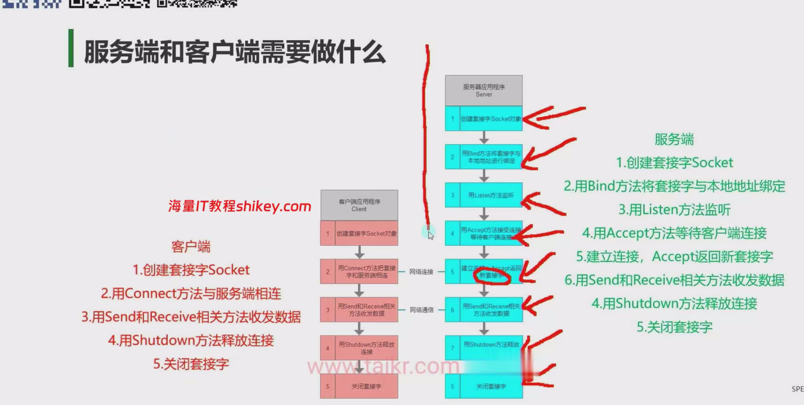
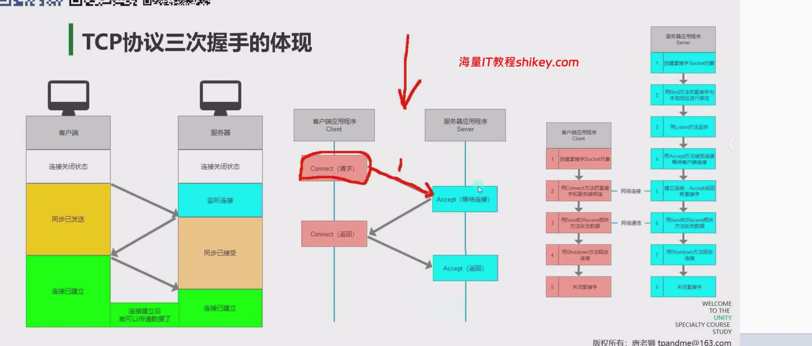
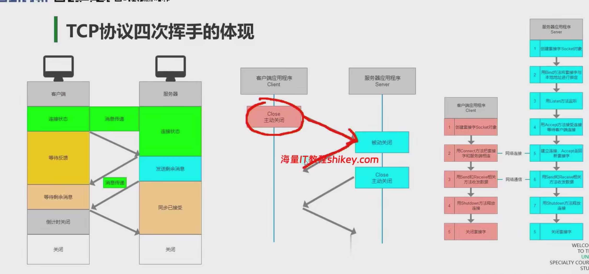
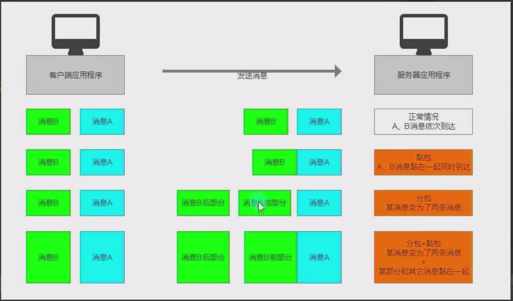

由Socket已经封装好了


# 分包黏包




# IP地址和端口类

## 1.IPAddress

初始化IP信息的方式 

```C#
//1.用byte数组进行初始化
byte[] ipAddress = new byte[4] { 192, 168, 1, 1 };
IPAddress iP1 = new IPAddress(ipAddress);   //声明一个IP地址对象

//2.用long长整型进行初始化
//4字节对应的长整型 一般不建议大家使用
IPAddress ip2 = new IPAddress(0x76666F0B);

//3.推荐使用的方式 使用字符串转换
IPAddress ip3 = IPAddress.Parse("192.168.1.1");

//特殊IP地址
//127.0.0.1代表本机地址

//一些静态成员
//获取可用的IPv6地址
//IPAddress.IPv6Any
```

## 2.IPEndPoint

IPEndPoint类将网络端点表示为IP地址和端口号 表现为IP地址和端口号的组合 

```C#
//初始化方法
IPEndPoint iPEndPoint1 = new IPEndPoint(IPAddress.Parse("192.168.1.1"), 8080);
IPEndPoint iPEndPoint2 = new IPEndPoint(0x76666F0B, 8080);
```

# 域名解析

## 1.IPHostEntry类 

命名空间:System.Net

类名:IPHostEntry

主要作用:域名解析后的返回值 可以通过该对象获取IP地址、主机名等等信息

该类不会自己声明，都是作为某些方法的返回值返回信息，我们主要通过该类对象获取返回的信息


获取关联IP          成员变量:AddressList   一个域名可能会对应多个IP地址

获取主机别名列表     成员变量:Aliases         一个域名可能对应多个别名

获取DNS名称         成员变量:HostName      该域名对应的DNS名称

## 2.Dns类

命名空间:System.Net

类名:Dns

主要作用:Dns是一个静态类  提供了很多静态方法，可以使用它来根据域名获取IP地址

```C#
//常用方法
//1.获取本地系统的主机名
print(Dns.GetHostName());

//2.获取指定域名的IP信息
//根据域名获取
//同步获取
//注意:由于获取远程主机信息是需要进行网路通信，所以可能会阻塞主线程
IPHostEntry entry =  Dns.GetHostEntry("www.baidu.com");
for(int i = 0; i < entry.AddressList.Length; i++)
{
	print("IP地址:" + entry.AddressList[i]);
}
for(int i = 0; i < entry.Aliases.Length; i++)
{
	print("别名:" + entry.Aliases[i]);
}
print("DNS名称:" + entry.HostName);

异步获取
GetHostEntry();

异步方法:
private async void GetHostEntry()
    {
        Task<IPHostEntry> task = Dns.GetHostEntryAsync("www.baidu.com");
        await task;

        for(int i = 0; i < task.Result.AddressList.Length; i++)
        {
            print("IP地址:" + task.Result.AddressList[i]);
        }
        for(int i = 0; i < task.Result.Aliases.Length; i++)
        {
            print("别名:" + task.Result.Aliases[i]);
        }
        print("DNS名称:" + task.Result.HostName);
    }
```

# 序列化与反序列化

网络通信中我们不能直接使用数据持久化2进制知识点中的

BinaryFormatter 2进制格式化类

因为客户端和服务器使用的语言可能不一样，BinaryFormatter是c#的序列化规则，和其它语言之间的兼容性不好

如果使用它，那么其它语言开发的服务器无法对其进行反序列化

我们需要自己来处理将类对象数据序列化为字节数组

[序列化的基类]: ./Code/BaseData.cs	"sss"

